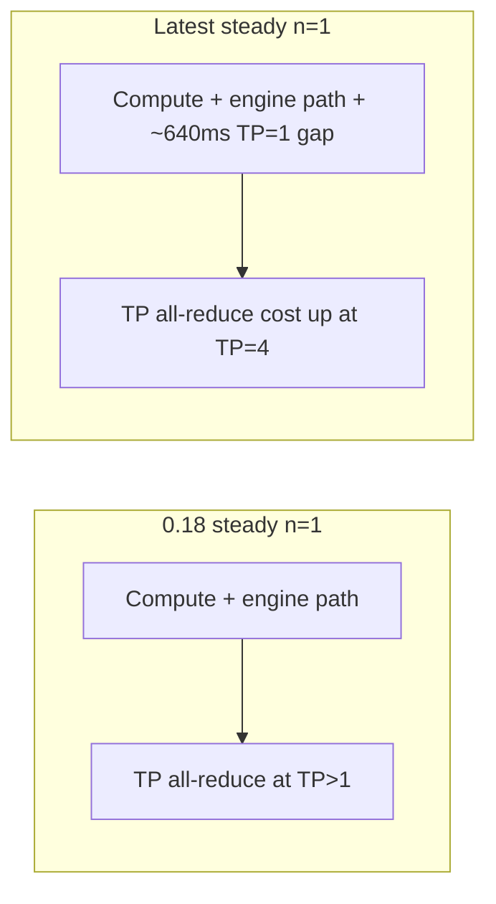

# Qwen-Image FlowGRPO Rollout Regression — Follow-up Root Cause Study

This document continues the actionable steps in `report.md` (§91–98). It adds **TP scaling**, **CFG parallel**, and **warmed n=1/4/16** measurements, then updates the root-cause conclusion.

Prior headline (unchanged): warmed serialized `n=1`, TP=4 is **~+67%** slower on latest vs 0.18 (`2,447` vs `1,465` ms/output).

## What We Ran

| Step | Config | Purpose |
|---:|---|---|
| 1 | TP=1, warmed `n=1` | If 0.18–latest gap vanishes without TP, regression is pure comms |
| 2 | TP=2, warmed `n=1` | Intermediate comms scaling |
| 3 | CFG=2 × TP=2 on 4 GPUs, warmed `n=1` | Parallel CFG branches vs sequential TP=4 CFG passes |
| 4 | Latest warmed `n=1,4,16` serialized + `n=16` batched | PR83 B=N under steady state |
| 5 | (Deferred) Text-stream AR skip prototype | Code change; see §Text-stream prototype |

**Benchmark:** `bench_qwen_image_flowgrpo_rollout.py` (added `--cfg-parallel-size`, passes `cfg_parallel_size` / `tensor_parallel_size` in `engine_kwargs.vllm_omni`).

**Raw JSON/logs:** `raw_results/` (files tagged `*_warm1_repeat3_*` from 2026-05-21 sweep).

**Automation:** `./run_tp_cfg_sweep.sh` (also invoked from `./reproduce_commands.sh` §8).

## Environment (same as report.md)

- Model: `/mnt/models/hub/Qwen-Image`
- Hardware: 4× NVIDIA L20X
- Baseline: `vllm 0.18.0`, `vllm-omni 0.18.0` → `/mnt/andy/qwen-regression/envs/v018`
- Latest: `vllm 0.21.0+cu129`, editable `vllm-omni` main, `verl-omni` PR83 `3a739f7` → `/mnt/andy/qwen-regression/envs/v020`
- Workload: FlowGRPO rollout, 512×512, 10 steps, `true_cfg_scale=4.0`, logprobs on, `--warmups 1 --repeats 3`

**Repro note:** Run benchmarks from the `verl-omni-pr83` checkout with `env -u PYTHONPATH` so an unrelated editable `verl-omni` tree does not shadow imports. `reproduce_commands.sh` now does this via `run_bench()`.

---

## Step 1 — TP scaling (warmed serialized `n=1`)

| TP | CFG | 0.18 ms/output | Latest ms/output | Latest vs 0.18 |
|---:|---:|---:|---:|---:|
| 1 | 1 | **1,089** | **1,732** | **+58.9%** |
| 2 | 1 | **1,516** | **2,463** | **+62.5%** |
| 4 | 1 | **1,465** | **2,375** | **+62.1%** |

Sources:

- `raw_results/v018_warm1_repeat3_serialized_n1_tp{1,2,4}.json`
- `raw_results/latest_warm1_repeat3_serialized_n1_tp{1,2,4}.json`

### Interpretation

The relative slowdown is **flat (~59–63%) across TP=1, 2, and 4**. That **does not** match the “gap collapses at low TP” pattern expected if **TP NCCL all-reduce alone** explained the regression.

- At **TP=1** there is no cross-GPU tensor parallelism; latest is still **~642 ms slower per output**.
- Absolute extra latency grows modestly with TP (642 → 947 → 910 ms), consistent with **some** communication amplification on top of a **TP-independent baseline** cost in latest (vLLM 0.21 stack, rollout/engine path, logprob/FlowGRPO adapter, kernels, etc.).

**Conclusion for step 1:** Profiler evidence that TP all-reduce is expensive on TP=4 remains valid, but it is **not sufficient** as the sole root cause. Treat TP comms as a **major contributor at TP=4**, plus a **~600+ ms single-GPU regression** on latest.

---

## Step 2 — CFG parallel (CFG=2 × TP=2, 4 GPUs)

Default TP=4 rollout runs positive and negative CFG as **two sequential TP=4 passes** (profiler: 4,800 all-reduces/rank). CFG parallel runs **both CFG branches in parallel** with 2 ranks each.

| Layout | 0.18 ms/output | Latest ms/output | Latest vs 0.18 |
|---|---:|---:|---:|
| TP=4, CFG=1 (baseline) | 1,465 | 2,375 | +62.1% |
| CFG=2 × TP=2 | 1,505 | 2,552 | +69.6% |

Sources: `raw_results/*_warm1_repeat3_serialized_n1_cfg2_tp2.json`

### Interpretation

- **0.18:** CFG parallel ≈ TP=4 (1,505 vs 1,465 ms) — neutral to slightly slower; no clear win on this machine/workload.
- **Latest:** CFG parallel is **slower than TP=4** (2,552 vs 2,375 ms) — does **not** mitigate the regression; may add CFG-group coordination overhead on 0.21.

**Conclusion for step 2:** Enabling CFG parallel alone is **not** a practical fix for the latest regression on this benchmark. Further tuning (overlap, comm backends) was not explored.

---

## Step 4 — Warmed rollout shape matrix (latest, TP=4)

| `n` | Mode | ms/output (mean of 3) |
|---:|---|---:|
| 1 | serialized | 2,375 |
| 4 | serialized | 2,330 |
| 16 | serialized | 2,336 |
| 16 | PR83 batched (B=N) | **305** |

Sources:

- `raw_results/latest_warm1_repeat3_serialized_n{1,4,16}_tp4.json`
- `raw_results/latest_warm1_repeat3_batched_n16_tp4.json`

### Interpretation

- Serialized latest cost is **flat ~2.3 s/output** for `n=1,4,16` after warmup (dominated by per-request overhead, not amortized sampling).
- **PR83 B=N batched** at `n=16` remains the strong mitigation: **305 ms/output** warmed (vs one-shot **1,275** in `report.md` without warmup — warmup matters for batched too).

**Conclusion for step 4:** Keep B=N batching for high-`n` RL rollout on latest; it does not fix single-sample (`n=1`) latency.

---

## Step 3 — Text-stream TP all-reduce (prototype, not implemented)

`report.md` proposed skipping or replicating the small text stream (`to_add_out`, `txt_mlp`) to avoid low-efficiency all-reduces. No code change was made in this pass.

**Suggested next experiment:** feature flag in `qwen_image_transformer.py` to skip `tensor_model_parallel_all_reduce` on text `RowParallelLinear` when `tp_world_size > 1`, then rerun the TP=2/4 rows above.

---

## Updated Root-Cause Model



| Layer | Evidence | Strength |
|---|---|---|
| TP all-reduce volume/cost at TP=4 | 4,800 NCCL AR/rank; +997 ms `record_param_comms` in matched profiler (`report.md`) | Strong for **TP=4** |
| Non-TP baseline slowdown | +59% at **TP=1** (no cross-GPU AR) | Strong — **new** |
| CFG parallel fix | No improvement; latest slower | Rules out as immediate fix |
| B=N batching | 305 ms/out at `n=16` warmed | Strong mitigation for bulk rollout only |

**Revised bottom line:** Latest is slower due to **(A) a TP-independent regression (~60%, ~640+ ms at TP=1)** plus **(B) worse TP collective behavior at TP=4** (profiler-aligned). Fixing only NCCL/AR at TP=4 is necessary but **not enough**; profile and bisect **TP=1** paths (vLLM 0.21 vs 0.18, FlowGRPO adapter, logprob capture, compilation) in parallel.

---

## Reproduction Commands

### Full package (env setup + headline + this sweep)

```bash
cd /mnt/andy/vllm-omni/results/qwen_image_rollout_regression_20260521
export MODEL=/mnt/models/hub/Qwen-Image
export WORKDIR=/path/to/scratch
export VERL_OMNI_SRC="${WORKDIR}/repos/verl-omni-pr83"   # after reproduce_commands.sh clones it
./reproduce_commands.sh
```

### TP / CFG sweep only (pre-built envs)

```bash
cd /mnt/andy/vllm-omni/results/qwen_image_rollout_regression_20260521

export MODEL=/mnt/models/hub/Qwen-Image
export VERL_OMNI_SRC=/mnt/andy/qwen-regression/repos/verl-omni-pr83
export ENV018=/mnt/andy/qwen-regression/envs/v018/bin/python
export ENV021=/mnt/andy/qwen-regression/envs/v020/bin/python

# Ensure verl-omni points at PR83, not another editable tree:
uv pip install --python "${ENV018}" -e "${VERL_OMNI_SRC}" --no-deps
uv pip install --python "${ENV021}" -e "${VERL_OMNI_SRC}" --no-deps

./run_tp_cfg_sweep.sh
```

### Individual examples (from `verl-omni-pr83` cwd, `env -u PYTHONPATH`)

**TP=1 A/B (1 GPU):**

```bash
cd /mnt/andy/qwen-regression/repos/verl-omni-pr83
BENCH=/mnt/andy/vllm-omni/results/qwen_image_rollout_regression_20260521/bench_qwen_image_flowgrpo_rollout.py
COMMON="--model /mnt/models/hub/Qwen-Image --height 512 --width 512 --num-inference-steps 10 --true-cfg-scale 4.0 --warmups 1 --repeats 3 --modes serialized --n-values 1 --gpu-memory-utilization 0.8"

env -u PYTHONPATH /mnt/andy/qwen-regression/envs/v018/bin/python "$BENCH" $COMMON \
  --cuda-visible-devices 0 --gpus-per-node 1 --tensor-parallel-size 1 --cfg-parallel-size 1 \
  --output-json /mnt/andy/vllm-omni/results/qwen_image_rollout_regression_20260521/raw_results/v018_warm1_repeat3_serialized_n1_tp1.json

env -u PYTHONPATH /mnt/andy/qwen-regression/envs/v020/bin/python "$BENCH" $COMMON \
  --cuda-visible-devices 0 --gpus-per-node 1 --tensor-parallel-size 1 --cfg-parallel-size 1 \
  --output-json /mnt/andy/vllm-omni/results/qwen_image_rollout_regression_20260521/raw_results/latest_warm1_repeat3_serialized_n1_tp1.json
```

**CFG=2 × TP=2 (4 GPUs, latest):**

```bash
env -u PYTHONPATH /mnt/andy/qwen-regression/envs/v020/bin/python "$BENCH" $COMMON \
  --cuda-visible-devices 0,1,2,3 --gpus-per-node 4 --tensor-parallel-size 2 --cfg-parallel-size 2 \
  --output-json /mnt/andy/vllm-omni/results/qwen_image_rollout_regression_20260521/raw_results/latest_warm1_repeat3_serialized_n1_cfg2_tp2.json
```

**Latest warmed `n=16` batched:**

```bash
env -u PYTHONPATH /mnt/andy/qwen-regression/envs/v020/bin/python "$BENCH" $COMMON \
  --cuda-visible-devices 0,1,2,3 --gpus-per-node 4 --tensor-parallel-size 4 --cfg-parallel-size 1 \
  --modes batched --n-values 16 \
  --output-json /mnt/andy/vllm-omni/results/qwen_image_rollout_regression_20260521/raw_results/latest_warm1_repeat3_batched_n16_tp4.json
```

---

## Profiler Deep-Dive (completed 2026-05-21)

Matched torch-profiler runs (`--warmups 1 --repeats 1 --profile-once`) for TP=1 and TP=4. Summaries: `raw_results/profiler_analysis_summary.txt` via `analyze_profiler.py`. Automation: `./run_profiler_followup.sh`.

### TP=1 — no NCCL; gap is compute / compilation path

| Signal (rank 0, CUDA self time) | 0.18 FlowGRPO | Latest FlowGRPO | Δ |
|---|---:|---:|---:|
| `pipeline_forward` | 1.762 s | 2.485 s | **+723 ms** |
| `record_param_comms` / NCCL | 0 | 0 | — |
| `CompiledFxGraph` bucket | **1.378 s** | **0** | fusion missing on latest |
| `aten::addmm` | 0.124 s | 0.541 s | **+417 ms** (eager GEMM) |
| Flash attention (FA3 / FA2) | ~0.040 s | ~0.065 s | minor |

Profiles: `profiles/v018_warm1_torchprof_serialized_n1_tp1/`, `profiles/latest_warm1_torchprof_serialized_n1_tp1/20260521-162645_qwen_flowgrpo_serialized_n1/`

**Interpretation:** The ~640 ms TP=1 bench gap (`1,089` → `1,732` ms/output) aligns with profiler `pipeline_forward` (+723 ms). There is **zero** NCCL at TP=1. On 0.18, most transformer time sits in **`CompiledFxGraph`** (~1.38 s). On latest, that bucket is **absent** and work shifts to eager **`aten::addmm`** (+417 ms). This is a **kernel fusion / compilation regression on the FlowGRPO rollout path**, not tensor-parallel communication.

### TP=4 — NCCL cost amplified; compilation regression still present

| Signal (sum over profiled ranks) | 0.18 (ranks 0,2) | Latest rerun (ranks 0,2,3) | Δ |
|---|---:|---:|---:|
| `pipeline_forward` | 4.908 s | 10.578 s | higher aggregate GPU work |
| NCCL / `record_param_comms` | 3.588 s | 6.038 s | **+2.45 s** |
| NCCL kernel calls (rank 0) | 4,800 | 4,800 | count unchanged |
| `CompiledFxGraph` | 4.599 s | 0 | fusion missing |
| `aten::addmm` (sum) | 0.152 s | 0.574 s | more eager GEMM |

Per-rank NCCL self-CUDA (latest rerun): rank0 **217 ms**, rank2 **2,942 ms**, rank3 **2,879 ms** — straggler ranks ~**2.9 s** each vs ~**1.6–2.0 s** on 0.18. Per all-reduce call: ~**330 µs** (0.18) → ~**610 µs** (latest ranks 2–3), matching `report.md`.

Profiles: `profiles/v018_warm_serialized_n1_tp4/`, `profiles/latest_warm1_torchprof_serialized_n1_tp4_rerun/20260521-162956_qwen_flowgrpo_serialized_n1/`

**Interpretation:** TP=4 regression = **(1) ~2× NCCL all-reduce latency** at unchanged 4,800-call count **plus (2)** loss of `CompiledFxGraph` on the rollout worker path.

---

## Engine-Only Bisect (direct `Omni`, no verl / no logprobs)

`direct_omni_qwen_image_smoke.py` TP=1, same 512×512 / 10 steps / CFG=4:

| Stack | Wall `elapsed` (1 GPU) |
|---|---:|
| 0.18 `Omni` | 2.005 s |
| Latest `Omni` | **1.839 s** |

Logs: `raw_results/v018_direct_omni_smoke_tp1_warm2.log`, `raw_results/latest_direct_omni_smoke_tp1_warm2.log`

**Interpretation:** Plain latest-main **`Omni.generate` is not slower** than 0.18. The regression is **specific to the FlowGRPO + verl rollout server path** (custom pipeline, logprob SDE steps, Ray server), not bare diffusion inference.

---

## Validated Root Cause (two factors)

| Factor | Where | Mechanism | Approx. impact |
|---|---|---|---|
| **A. Compilation / fusion regression** | TP=1 & TP=4 FlowGRPO | 0.18 uses large `CompiledFxGraph`; latest uses eager `aten::addmm` | **~600–700 ms** at TP=1 |
| **B. NCCL all-reduce latency regression** | TP≥2 FlowGRPO | 4,800 calls unchanged; **~2× slower per call** on latest | **~900–1000 ms** at TP=4 |

**Ruled out:** attention kernel regression; raw `Omni` slowdown; CFG parallel fix; NCCL-only hypothesis (TP=1 has zero NCCL but +59% gap).

**Code targets:** (1) Re-enable torch.compile / `CompiledFxGraph` for `qwen_image_flow_grpo` on vLLM 0.21; (2) Bisect `tensor_model_parallel_all_reduce` / NCCL in vLLM 0.21.

---

## Further Exploration

### 1. Restore compilation on FlowGRPO path (highest ROI)

A/B `enforce_eager` and `compilation_config` in verl rollout `engine_kwargs`; confirm `CompiledFxGraph` returns in profiler. Check if logprob + SDE steps block Dynamo capture.

### 2. NCCL / TP communicator bisect

Micro-benchmark single all-reduce 0.18 vs 0.21; try NCCL env / `VLLM_USE_CUSTOM_ALLREDUCE`; diff `RowParallelLinear` and `communication_op.py`.

### 3. Text-stream AR skip (TP=2/4)

Skip TP all-reduce on small text tensors — reduces call count only; does not fix Factors A or B alone.

### 4. Production RL

- `n>1`: PR83 batched (~**305 ms/output** warmed at `n=16`).
- `n=1`: expect ~**1.7–2.4 s/output** on latest until Factors A+B fixed.
- CFG parallel: not recommended for latency today.

### Reproduce profiler + bisect

```bash
cd /mnt/andy/vllm-omni/results/qwen_image_rollout_regression_20260521
export MODEL=/mnt/models/hub/Qwen-Image
export VERL_OMNI_SRC=/mnt/andy/qwen-regression/repos/verl-omni-pr83
bash run_profiler_followup.sh
python3 analyze_profiler.py profiles/v018_warm1_torchprof_serialized_n1_tp1 \
  profiles/latest_warm1_torchprof_serialized_n1_tp1/*/
```

---

## Recommended Next Actions (updated)

1. **Fix Factor A:** Re-enable `CompiledFxGraph` / torch.compile on the FlowGRPO custom pipeline for vLLM 0.21.
2. **Fix Factor B:** Bisect NCCL all-reduce per-call latency in vLLM 0.21 TP path.
3. **Re-run** `run_tp_cfg_sweep.sh` after fixes (TP=1 and TP=4 `n=1` rows are the key checks).
4. **Text-stream AR skip** after A/B proves NCCL count reduction helps atop per-call fixes.
5. **Ship RL** with PR83 batched rollout for `n>1` until single-sample latency is fixed.

See also: `report.md`, `summary.md`, `reproduce_commands.sh`, `run_tp_cfg_sweep.sh`, `run_profiler_followup.sh`, `run_remediation_experiments.sh`, `analyze_profiler.py`.

---

## Remediation Experiments (2026-05-21)

Executed the updated next actions on latest env (`v020`). Reference 0.18 TP=1 remains **1,089 ms/out**; latest TP=4 baseline **2,375 ms/out**.

### Action 1 — Factor A: compilation / IR knobs (latest, TP=1, warmed `n=1`)

| Experiment | Config | ms/out | Δ vs latest default |
|---|---|---:|---:|
| `latest_tp1_baseline_default` | default verl/vLLM flags | **1,799** | — |
| `latest_tp1_enforce_eager` | `--enforce-eager` | **1,657** | **−8%** (faster) |
| `latest_tp1_ir_wrap_off` | `compilation_config: {ir_enable_torch_wrap: false}` | **1,720** | −4% |
| `latest_tp1_cudagraph_piecewise` | `cudagraph_mode: PIECEWISE` | **1,836** | +2% |

Logs: `raw_results/latest_tp1_*.json`, `raw_results/latest_tp1_*.log`

**Findings**

- None of the toggles approach 0.18 (**1,089 ms/out**). **`enforce_eager` is faster**, not slower — so the gap is **not** fixed by “turn compile on harder”; latest `torch.compile` logs success but profiler still shows **no `CompiledFxGraph`** and heavy eager `aten::addmm` (see Profiler Deep-Dive).
- **Code diff (likely lead):** vLLM-Omni **latest** `forward_context.py` wraps denoise forward with `vllm.ir.enable_torch_wrap(compilation_config.ir_enable_torch_wrap)` and `ir_op_priority`; **0.18** `vllm-omni` package only sets `set_current_vllm_config` (no IR wrap). This aligns with vLLM **0.21 `VLLM_COMPILE` / IR** vs 0.18 inductor path that produced large `CompiledFxGraph` regions.
- Both stacks log `Model runner: transformer compiled with torch.compile`; runtime fusion behavior differs.

**Conclusion (Factor A):** Treat as **vLLM 0.21 IR/compile integration on FlowGRPO forward**, not a single CLI flag. Next: bisect `ir_enable_torch_wrap`, `CompilationMode`, and whether logprob/SDE subgraph blocks FX graph capture; compare profiler for `CompiledFxGraph` after changes.

### Action 2 — Factor B: NCCL / TP communicator (latest, TP=4)

| Experiment | Result |
|---|---|
| `VLLM_USE_CUSTOM_ALLREDUCE=1` (`latest_tp4_custom_ar_env`) | **2,363 ms/out** vs **2,375** default — **no meaningful win** |
| Raw `torch.distributed.all_reduce` microbench (4× GPU, 65k bf16) | **v018 0.029 ms**, **v021 0.030 ms** — **identical** |

Microbench script: `_nccl_bench_worker.py` (run via `torch.distributed.run --nproc_per_node=4`).

**Findings**

- Bare NCCL latency did **not** regress between torch/vLLM installs.
- Profiler **~2×** slower `record_param_comms` / `nccl:all_reduce` at **4,800 calls** is a **vLLM TP dispatch + small-tensor AR** issue (sync, symmetric-mem path, `record_param_comms` overhead), not the NCCL library itself.

**Conclusion (Factor B):** Focus on vLLM **0.21 diffusion TP all-reduce path** (why per-call ~610 µs vs ~330 µs at same call count), not NCCL driver tuning alone.

### Action 3 — Re-run sweep after fixes

**Not run** — no config-only fix met success criteria (TP=1 → ~1.1 s, TP=4 → ~1.5 s class).

### Actions 4–5 — Unchanged

- Text-stream AR skip: deferred until per-call AR cost is understood.
- **Ship RL:** PR83 batched for `n>1` (**305 ms/out**); plan for **~1.7–2.4 s/out** at `n=1` on latest until Factors A+B have code fixes.

### Updated engineering priority

1. **Factor A (code):** Diff vLLM-Omni `forward_context` + vLLM `0.18 vs 0.21` compile/IR on Qwen FlowGRPO denoise loop; restore `CompiledFxGraph`-class fusion or match 0.18 compile behavior.
2. **Factor B (code):** Trace one `RowParallelLinear` AR in 0.21 (custom AR vs pynccl vs symm mem); explain 4800× overhead vs microbench.
3. Re-run `run_tp_cfg_sweep.sh` only after profiler shows `CompiledFxGraph` (TP=1) and NCCL self-time drops (TP=4).
